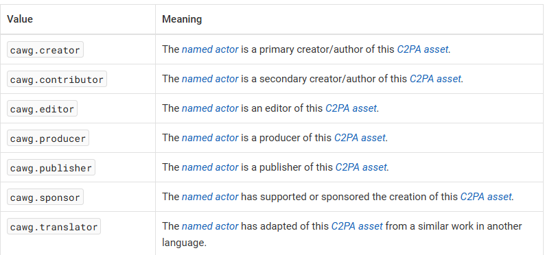

## Manifest design
The verifier will expect the following:

- Information about `role` should go directly in `cawg.identity` (see section 0)
- All the following assertions should be referenced in manifest or they will not be considered!
- AI optout should go in `cawg.training-mining` or `c2pa.training-mining` (see section 1) 
- Information about organization and videographer should go in:  `stds.schema-org.CreativeWork` assertion (see section 2)


## CAWG Identity assertions:
### Roles:
Please restrict the roles to exactly these:
- At ingestion: `cawg.producer` 
- At publication: `cawg.publisher`
- At production: Video editor should use `cawg.editor` (out of our scope!)


Source: https://cawg.io/identity/1.3-draft+vc-vp+new-introduction/#_named_actor_roles\

### Referenced asesertions:
- All the assertions in the subsequestion sections should be referenced in the manifest, or they will not be shown!

### Section 1: Training and Data mining Optout

- Both of these should be referenced in the `cawg.identity` assertion as a referenced assertions. Usage should be be exactly one of: `allowed` , `notAllowed` or `constrained`

#### CAWG (standard):
```json
 "cawg.training-mining": {
    "entries": {
      "cawg.ai_generative_training": {
        "use": "notAllowed"
      },
      "cawg.ai_inference": {
        "use": "notAllowed"
      },
      "cawg.ai_training": {
        "use": "allowed"
      }, 
      "cawg.data_mining" : {
        "use" : "constrained"
      }
    }
}
```

#### C2PA (eprecated since C2PA v2.0)
This assertion should be used for maximum compatibility with old verifiers. Same as cawg assertion but different labels.
```json
"c2pa.training-mining": {
    "entries": {
      "c2pa.ai_generative_training": {
        "use": "notAllowed"
      },
      "c2pa.ai_inference": {
        "use": "notAllowed"
      },
       "c2pa.ai_training": {
        "use": "allowed"
      }, 
      "c2pa.data_mining" : {
        "use" : "constrained"
      }
    }
}
```

## Section 2: CreativeWork schema
Use creative schema for teh following information:
- Organization 
  - name
  - Website
  - Org identifier: 
    - Use `identifer` by default
    - Othe

- Videographer
  - Department
  - Job Title /skill
  - Identifier
  - email

- Times:
  - dateCreated: When video was taken
  - datePublished: When video was published

- License:
  - a url to a general purpose license

and reference it in your `cawg.identity` assertion.
This will allow other verifiers such as https://contentauthenticity.adobe.com/inspect to honor the display of some that infromation.


```json
{
    "label": "stds.schema-org.CreativeWork",
    "data": {
        "@context": "https://schema.org",
        "@type": "CreativeWork",
        "author": [
            { 
                "@type": "Person",
                "name": "{Videographer name}",
                "hasOccupation": {
                  "@type": "Occupation",
                  "skills": "{Camera operator}"
                },
                "email": "{jane.doe@cbc.ca}",
                "affiliation": {
                  "@type": "Organization",
                  "value" : "{Videographer's department}" 
                }

            },
            {
              "@type": "Organization",
              "name": "{CBC Organization}",
              "url": "{https://cbc.ca/}",
              // Use identifier by default
              "identifier" : "such as ISBNs, GTIN codes, UUIDs etc",  
              // Optional
              "leiCode" : "An organization identifier that uniquely identifies a legal entit as defined in ISO 17442.",
              // Optional
              "iso6523Code" : "An organization identifier as defined in ISO 6523(-1). The identifier should be in the XXXX:YYYYYY:ZZZ or XXXX:YYYYYYformat. Where XXXX is a 4 digit ICD (International Code Designator), YYYYYY is an OID (Organization Identifier) with all formatting characters (dots, dashes, spaces) removed with a maximal length of 35 characters, and ZZZ is an optional OPI (Organization Part Identifier) with a maximum length of 35 characters. The various components (ICD, OID, OPI) are joined with a colon character (ASCII 0x3a). Note that many existing organization identifiers defined as attributes like leiCode (0199), duns (0060) or GLN (0088) can be expressed using ISO-6523. If possible, ISO-6523 codes should be preferred to populating vatID or taxID, as ISO identifiers are less ambiguous."
            }
        ],
        "dateCreated": 
            {
                "@type": "DateTime",
                "value": "{2024-09-11T04:00:00Z}"
            }
            ,
        "datePublished": 
            {
                "@type": "DateTime",
                "value": "{2024-09-12T02:03:00Z}"
            },
        // Use general purpose license from CC to show case idea for now
        "license" : "https://creativecommons.org/publicdomain/zero/1.0/"
    },
    "kind": "Json"
}
```

## Content Licensing 
⚠️ Complexe we keep for after..., many questions..
- Use the ordl https://www.w3.org/TR/odrl-model/
- How to label assertion in manifest?
- What identifier to use?
- What indicator to use EBUCorePlus, std-schema, IPTC (images), all of them? 

```json
// AI GENERATED ordl license
{
  "license_reference": "urn:contract:LIC-2026-00421",
  "rights_summary": "SVOD in France and Belgium from 2026-04-01 to 2027-03-31; no social media advertising use",
  "rights_policy": {
    "@context": "http://www.w3.org/ns/odrl.jsonld",
    "type": "Set",
    "permission": [
      {
        "target": "urn:asset:movie-123",
        "action": "display",
        "constraint": [
          { "leftOperand": "spatial", "operator": "eq", "rightOperand": ["FR", "BE"] },
          { "leftOperand": "dateTime", "operator": "gteq", "rightOperand": "2026-04-01T00:00:00Z" },
          { "leftOperand": "dateTime", "operator": "lt", "rightOperand": "2027-04-01T00:00:00Z" }
        ]
      }
    ],
    "prohibition": [
      {
        "target": "urn:asset:movie-123",
        "action": "advertising"
      }
    ]
  }
}
```